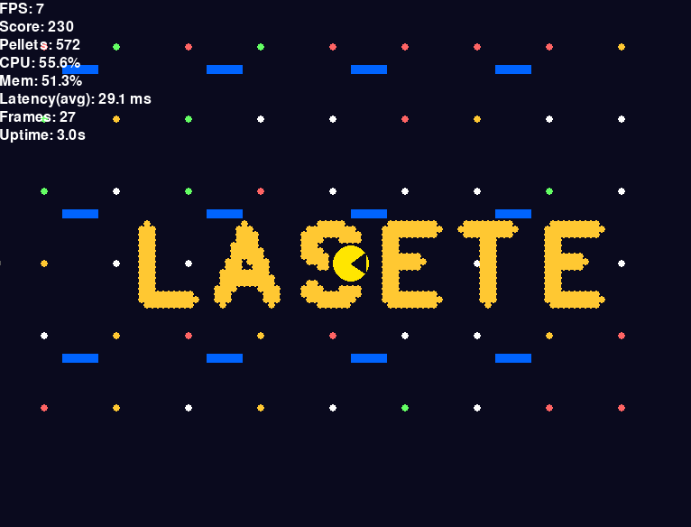

# ⚠️ Aviso importante

O criador desse código **estava com preguiça** e pediu pra uma **IA escrever esse resumo**.  
Então se você está lendo isso para apresentar no **Giro de Profissões**, relaxa:  
a IA vai te explicar tudo direitinho e te ensinar como rodar o projeto 😎  

---

# 🎮 Pacmano — O Pac-Man controlado pela sua mão!


Esse projeto é uma mistura divertida entre **Visão Computacional** e **Jogos em Python**.  
Você controla o **Pacmano** (uma versão simplificada do Pac-Man) **movendo seu dedo na frente da webcam**!

O personagem se move para onde você aponta, come bolinhas coloridas e exibe informações de desempenho em tempo real (FPS, uso de CPU, memória etc).

---

## 🧠 O que o código faz (em palavras simples)

1. **Abre a câmera do seu computador** usando o OpenCV.  
2. **Detecta sua mão** com a biblioteca MediaPipe.  
3. **Pega a posição do seu dedo indicador** para mover o Pacmano na tela.  
4. **Desenha o jogo** usando o Pygame — o Pacmano come bolinhas e mostra o placar.  
5. Mostra **estatísticas técnicas** (FPS, uso de CPU e memória, latência de detecção, tempo de execução).  
6. Você pode ver o vídeo da webcam em uma janelinha separada.

Basicamente: **você joga Pac-Man mexendo o dedo!**

---

## 🧩 Tecnologias utilizadas

- 🧱 **Python 3.9+**
- 🎮 **Pygame** — para criar o jogo e desenhar tudo na tela
- 👋 **MediaPipe** — para rastrear sua mão via webcam
- 🎥 **OpenCV** — para capturar as imagens da câmera
- 🧮 **NumPy** — para cálculos e processamento de imagem
- 📈 **psutil** — para monitorar CPU e memória em tempo real
- ⏱️ **time / math / random** — utilitários para movimentação e lógica

---

## ⚙️ Como rodar o projeto na sua máquina

### 1️⃣ — Instale o Python
Se você ainda não tem, baixe aqui:  
👉 https://www.python.org/downloads/

**ADICIONADO POR MIM, O FODÃO, O CRIADOR, GOD, O MELHOR DIRETOR DA LASETE -> USEM A VERSÃO 3.11, AS OUTRAS SEMPRE DÁ B.O, FIQUEI PAPO DE 40 MINUTOS TENTANDO ACHAR UMA VERSÃO DECENTE QUE ACEITASSE TODAS AS BIBLIOTECAS AAAAAAAAAAAAAAAAA**

**ADICIONADO POR MIM, O FODÃO, O CRIADOR, GOD, O MELHOR DIRETOR DA LASETE -> USEM A VERSÃO 3.11, AS OUTRAS SEMPRE DÁ B.O, FIQUEI PAPO DE 40 MINUTOS TENTANDO ACHAR UMA VERSÃO DECENTE QUE ACEITASSE TODAS AS BIBLIOTECAS AAAAAAAAAAAAAAAAA**

**ADICIONADO POR MIM, O FODÃO, O CRIADOR, GOD, O MELHOR DIRETOR DA LASETE -> USEM A VERSÃO 3.11, AS OUTRAS SEMPRE DÁ B.O, FIQUEI PAPO DE 40 MINUTOS TENTANDO ACHAR UMA VERSÃO DECENTE QUE ACEITASSE TODAS AS BIBLIOTECAS AAAAAAAAAAAAAAAAA**

Durante a instalação, **marque a opção “Add Python to PATH”**.

---

### 2️⃣ — Baixe as bibliotecas necessárias

Abra o terminal (ou prompt de comando) na pasta do projeto e execute:

```bash
pip install pygame opencv-python mediapipe psutil numpy
```

### 3️⃣ — Rode o jogo

Ainda no terminal, execute:

```bash
python joguin.py
```

### 4️⃣ — Como jogar

Aponte o dedo indicador na frente da webcam. 

*(olha, de novo eu aqui, revisando o que a IA tá explicando. tem que ficar literalmente 🤓☝️ assim pra ele se mexer)*

**(olha, de novo eu aqui, revisando o que a IA tá explicando. tem que ficar literalmente 🤓☝️ assim pra ele se mexer)**

_(olha, de novo eu aqui, revisando o que a IA tá explicando. tem que ficar literalmente 🤓☝️ assim pra ele se mexer)_

__claramente é mentira, mas falem isso pra quem for testar, vai ser mt engraçado__

O Pacmano vai se mover para onde o seu dedo estiver.

Tente comer todas as bolinhas na tela.

Pressione Q para sair do jogo.

### 🧾 O que aparece na tela

Na lateral do jogo, você verá algumas informações:

    🎯 FPS: taxa de quadros por segundo (quanto maior, mais fluido)

    💾 CPU e Memória: uso em tempo real do seu computador

    🍒 Score: sua pontuação (quantas bolinhas comeu)

    🕒 Uptime: quanto tempo o jogo está rodando

    ⚡ Latency: tempo que o MediaPipe demora pra processar a imagem

    🧱 Curiosidades técnicas

As paredes azuis são apenas obstáculos visuais (o Pacmano não pode atravessar).

As letras “LASETE” são desenhadas com pequenas bolinhas — o código converte letras em pontos!

O jogo roda a 30 FPS e usa rastreio de mão em tempo real.

O personagem abre e fecha a boca continuamente, simulando a animação clássica do Pac-Man.

### 💡 Dica para a apresentação

Se for apresentar no Giro de Profissões:

Explique que o projeto mostra como jogos e IA podem se misturar.

Mostre o rastreamento da mão na câmera e o Pacmano respondendo aos movimentos.

Diga que o MediaPipe é uma IA do Google que reconhece mãos e rostos.

E finalize com algo tipo:
“Esse é o Pacmano, o Pac-Man que obedece o seu dedo!”

Feito com 🧠, 🎮 e um pouquinho de preguiça.


KKKKKKKKKKKKKKKKKKK, OLHA ESSA IA, QUE DJABO DE FINALIZAÇÃO FOI ESSA... mas de resto, tá tudo nos conformes, é só seguir esse roteirinho que vai ficar tudo sussa na montanha-russa... qualquer coisa, me liguem no zap (98) 9... claramente nn vou botar meu número no github, galera, vcs sabem meu número

